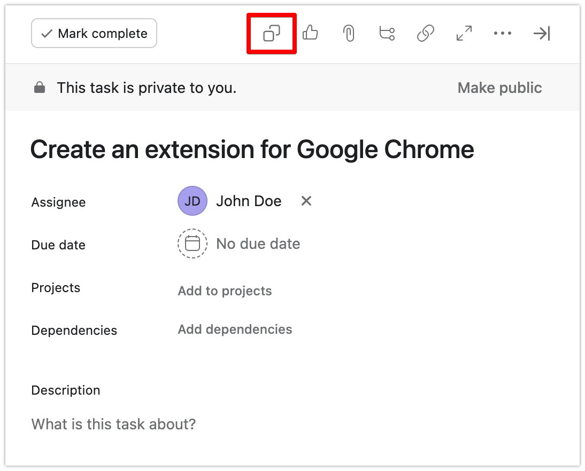
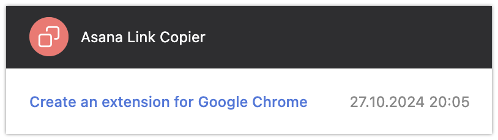

<h1 align="center">
     
    Asana Link Copier
</h1>

The Asana Link Copier Chrome extension helps you effortlessly copy Asana task links with the task title embedded as a hyperlink.
Perfect for project managers, team leads, and Asana users, this extension allows you to create clean, clickable links to Asana tasks,
making it easy to share organized information across your team.

## Features

- One-Click Copying: Copy the task title along with the URL with just one click.

- Copy History: View the history of previously copied task references.

## Example

**Original Link (from Asana):**

https://app.asana.com/0/1234/1234/f

**Copied Link (after clicking the extension button):**

[Create an extension for Google Chrome](https://app.asana.com/0/1234/1234/f)

## Installation

Since this extension is not yet available on the Chrome Web Store, you can install it manually using Developer Mode in Chrome. Follow these steps:

1. **Clone or Download the Repository:** Clone [this repository](https://github.com/Uolary/Asana-Link-Copier) to your local machine, or download it as a ZIP and extract it to a folder.

2. **Open Chrome and Navigate to Extensions:** In Chrome, go to `chrome://extensions/` or click on the three-dot menu in the top-right corner, then go to **More tools** > **Extensions**.

3. **Enable Developer Mode:** In the Extensions page, toggle **Developer mode** on (top-right corner of the page). This will allow you to load unpacked extensions.

4. **Load the Unpacked Extension:** Click the **Load unpacked** button and select the folder [extension](./extension) from the saved repository.

5. **Pin the Extension (Optional):** To make it easily accessible, click on the puzzle icon in your Chrome toolbar, find **Asana Link Copier** in the list, and pin it.