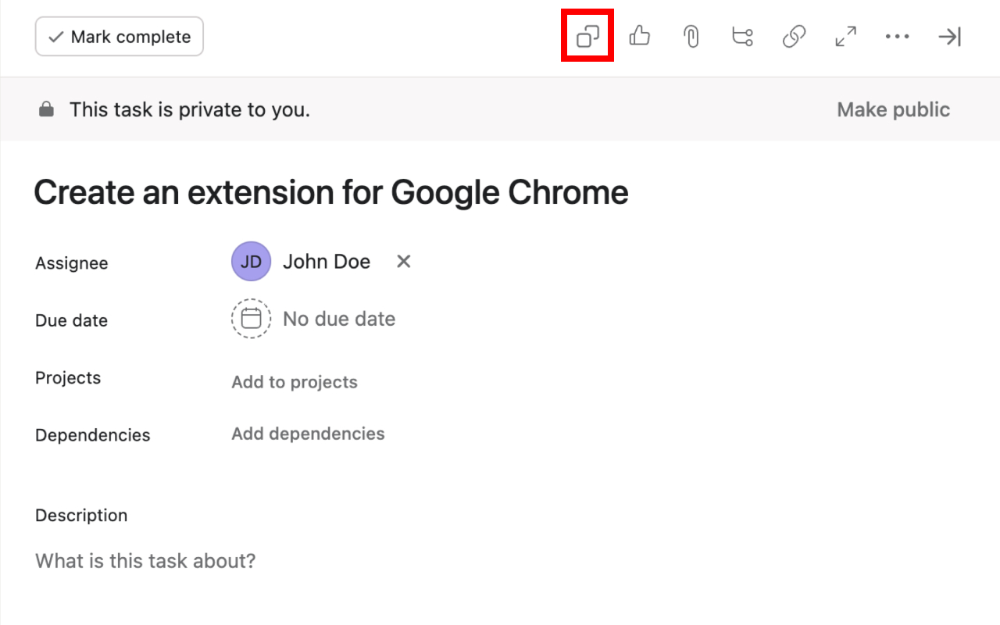
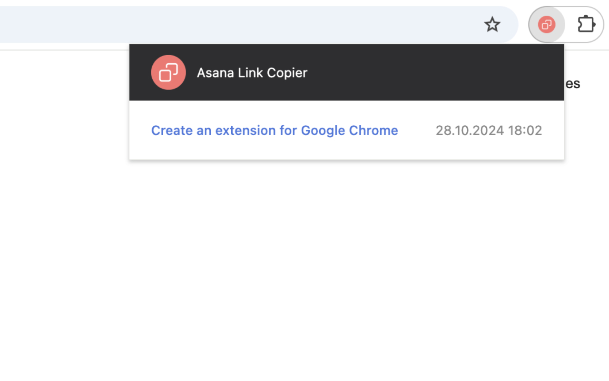

<h1 align="center">
     
    Asana Link Copier
</h1>

The Asana Link Copier Chrome extension helps you effortlessly copy Asana task links with the task title embedded as a hyperlink.

Easily copy task links with titles in Asana!
This extension helps you stay organized and productive by allowing you to copy task URLs along with their titles as clickable hyperlinks.
With just a click, save and retrieve task links for quick access, perfect for managing tasks across projects or sharing with teammates.

## Features

- One-Click Copying: Quickly copy task URLs with titles as hyperlinks.

- Copy History: Access recent task links without hassle.

- Privacy: All data is stored locally within your browser, ensuring privacy.

## Example

**Original Link (from Asana):**

https://app.asana.com/0/1234/1234/f

**Copied Link (after clicking the extension button):**

[Create an extension for Google Chrome](https://app.asana.com/0/1234/1234/f)

## Installation

You can find this extension in [Chrome Web Store](https://chromewebstore.google.com/detail/asana-link-copier/ndnlbajcijcampoioioalcmfehdlbkjn) or install it manually using developer mode in Chrome. Follow these steps:

1. **Clone or Download the Repository:** Clone [this repository](https://github.com/Uolary/Asana-Link-Copier) to your local machine, or download it as a ZIP and extract it to a folder.

2. **Open Chrome and Navigate to Extensions:** In Chrome, go to `chrome://extensions/` or click on the three-dot menu in the top-right corner, then go to **More tools** > **Extensions**.

3. **Enable Developer Mode:** In the Extensions page, toggle **Developer mode** on (top-right corner of the page). This will allow you to load unpacked extensions.

4. **Load the Unpacked Extension:** Click the **Load unpacked** button and select the folder [extension](./extension) from the saved repository.

5. **Pin the Extension (Optional):** To make it easily accessible, click on the puzzle icon in your Chrome toolbar, find **Asana Link Copier** in the list, and pin it.